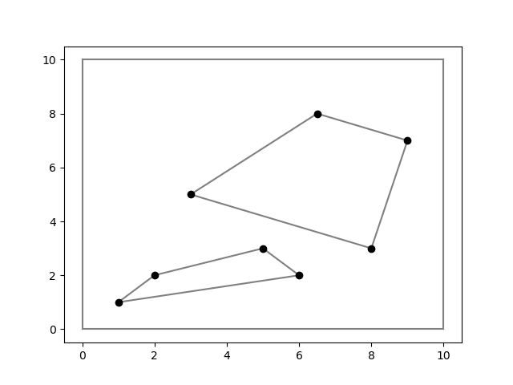
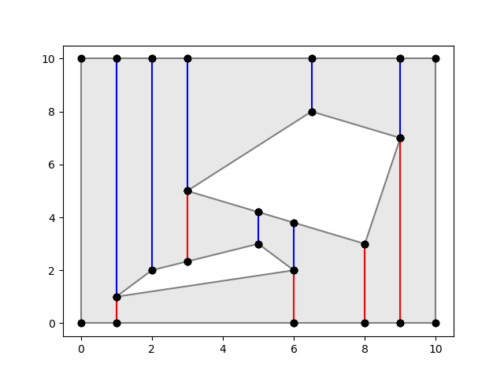
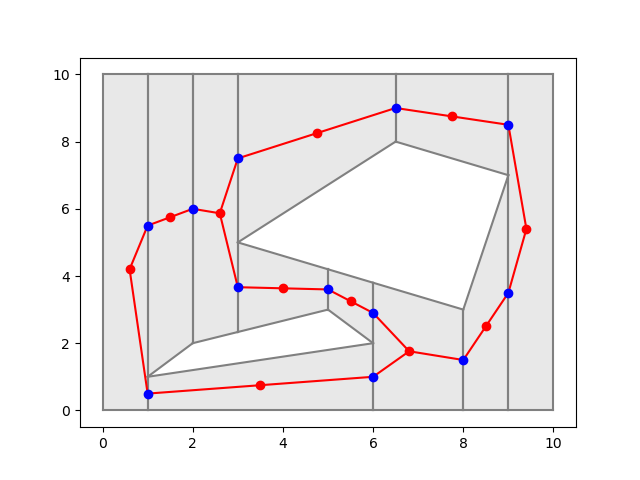
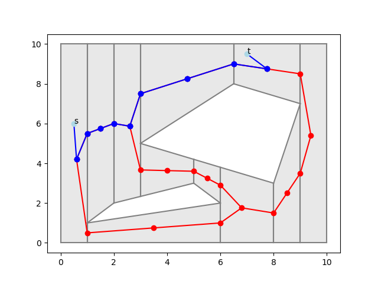

Project for CS 290: Computational Geometry at Duke University, fall 2024. This project implements motion planning for a `point' robot among polygonal obstacles, contained in a rectangular region. In other words, the workspace is a rectangle with polygonal holes.

## Figures

Figure 1: An example workspace with two polygonal obstacles, which are represented by two inner cycles of the polygon.

Figure 2: The vertical decomposition of the workspace, where the red segments erect downwards from obstacle vertices and blue segments erect upwards from obstacle vertices. Note that there are no vertical segments inside the inner cycles.

Figure 3: The roadmap, where we have a vertex per trapezoid and each vertical edge of the trapezoids.

Figure 4: The shortest path, by number of edges, from $s$ to $t$ in the roadmap graph. The first and last edges are to/from the centers of the trapezoids that contain $s,t$.
Specifically, one should return four items, the first two being the visible segment and the point on it upwards from the given query point, and the last two being the visible segment and the point on it downards from the given query point. **Furthermore, we do not consider a segment containing a query point to be visible**, otherwise this method would trivially always return the segment that a query vertex belongs to.
